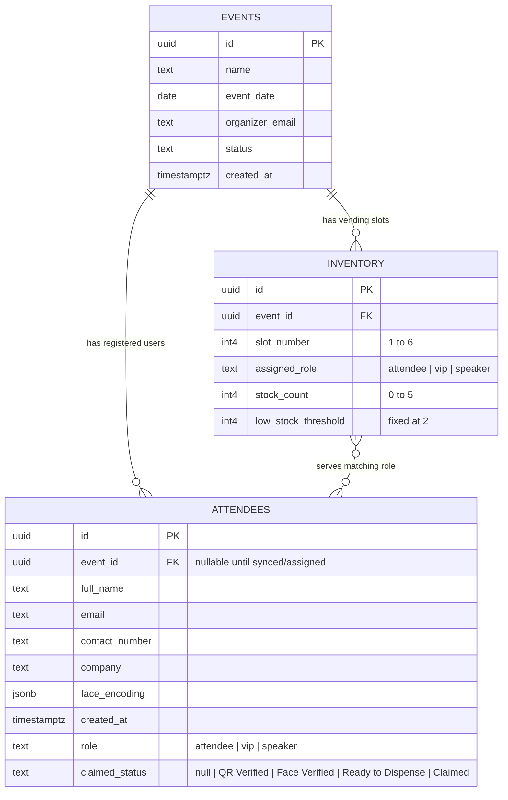

# VENDY System ERD

This ERD is based on the Supabase schema shown in the dashboard screenshot and the code paths in:

- `webapp`: admin dashboard, event management, inventory management, role assignment, claim API
- `regform`: attendee registration, email verification, face capture, QR generation
- `vendoraspi`: vending/Raspberry Pi client, inferred from the `webapp` claim API because no local `vendoraspi` folder was found

## Complete ERD



## Table Details

### `events`

Stores events created in the admin dashboard.

| Field | Type | Key | Description |
|---|---:|---|---|
| `id` | `uuid` | PK | Unique event ID. Used in dashboard URLs and registration links. |
| `name` | `text` |  | Event name shown in admin and registration pages. |
| `event_date` | `date` |  | Event date. |
| `organizer_email` | `text` |  | Event staff/admin email assigned to manage the event. |
| `status` | `text` |  | Event lifecycle, mainly `ACTIVE` or `ENDED`. |
| `created_at` | `timestamptz` |  | Creation timestamp. |

### `attendees`

Stores registered users from `regform` and claim progress from `vendoraspi`.

| Field | Type | Key | Description |
|---|---:|---|---|
| `id` | `uuid` | PK | Unique attendee ID. This is also encoded into the QR code. |
| `event_id` | `uuid` | FK | References `events.id`. Can be null for unassigned attendees. |
| `full_name` | `text` |  | Registered attendee name. |
| `email` | `text` |  | Registered attendee email. Checked for duplicates per event. |
| `contact_number` | `text` |  | Attendee phone/contact number. |
| `company` | `text` |  | Attendee company or organization. |
| `face_encoding` | `jsonb` |  | Face descriptor captured during registration. |
| `created_at` | `timestamptz` |  | Registration timestamp. |
| `role` | `text` |  | Kit/category role: `attendee`, `vip`, or `speaker`. |
| `claimed_status` | `text` |  | Claim progress/status. |

### `inventory`

Stores the six vending slots generated for each event.

| Field | Type | Key | Description |
|---|---:|---|---|
| `id` | `uuid` | PK | Unique inventory slot ID. |
| `event_id` | `uuid` | FK | References `events.id`. Deletes cascade when the event is deleted. |
| `slot_number` | `int4` |  | Physical vending slot number, limited to 1-6. |
| `assigned_role` | `text` |  | Role served by this slot: `attendee`, `vip`, or `speaker`. |
| `stock_count` | `int4` |  | Remaining stock, limited to 0-5. |
| `low_stock_threshold` | `int4` |  | Low-stock alert threshold, fixed at 2. |

## Relationships

| Relationship | Cardinality | Meaning |
|---|---|---|
| `events.id` to `attendees.event_id` | One event to many attendees | Each event can have many attendees. Each attendee belongs to one event, though `event_id` may temporarily be null. |
| `events.id` to `inventory.event_id` | One event to many inventory slots | Each event gets up to six vending machine slots. |
| `inventory.assigned_role` to `attendees.role` | Logical many-to-many by role | No direct foreign key, but the vending flow selects inventory slots whose `assigned_role` matches the attendee `role`. |

## Constraints And Business Rules

| Rule | Source |
|---|---|
| Each event automatically creates 6 inventory slots. | `webapp/src/hooks/useActiveEvent.ts` |
| Inventory slot numbers must be 1 through 6. | `webapp/supabase_inventory_slots.sql` |
| Each event can only have one record per slot number. | Unique constraint on `inventory(event_id, slot_number)` |
| Inventory role must be `attendee`, `vip`, or `speaker`. | `webapp/supabase_inventory_slots.sql` |
| Stock count must stay between 0 and 5. | `webapp/supabase_inventory_slots.sql` |
| Low-stock threshold is fixed at 2. | `webapp/supabase_inventory_slots.sql` |
| Registration only works for `ACTIVE` events. | `regform/src/app/page.tsx` |
| Duplicate attendee email is checked per event. | `regform/src/app/page.tsx` |
| Claimed attendees cannot change roles in the admin UI. | `webapp/src/components/UsersTable.tsx` |
| Claiming requires QR verification, face verification, then IR/breakbeam confirmation. | `webapp/src/app/api/claim-kit/route.ts` |
| Final claim decrements the first available inventory slot matching attendee role. | `webapp/src/app/api/claim-kit/route.ts` |

## System Use By App

| App | Reads | Writes/Updates |
|---|---|---|
| `regform` | `events`, `attendees` | Inserts into `attendees` with default `role = attendee` and captured `face_encoding`. |
| `webapp` | `events`, `attendees`, `inventory` | Creates/ends events, creates inventory slots, updates attendee roles, restocks/updates slots. |
| `vendoraspi` | `attendees`, `events`, `inventory` through claim API | Updates `attendees.claimed_status`; decrements `inventory.stock_count` after successful claim. |

## Claim Status Flow

```mermaid
stateDiagram-v2
    [*] --> Unclaimed
    Unclaimed --> "QR Verified": QR scan
    Unclaimed --> "Face Verified": Face match
    "QR Verified" --> "Ready to Dispense": Face match
    "Face Verified" --> "Ready to Dispense": QR scan
    "Ready to Dispense" --> Claimed: IR/breakbeam confirms item taken
    Claimed --> [*]
```

## Recommended Database Constraints

These constraints are implied by the app and would make the ERD stricter in Supabase:

```sql
alter table public.attendees
    add constraint attendees_event_id_fkey
    foreign key (event_id)
    references public.events(id)
    on delete set null;

alter table public.attendees
    add constraint attendees_role_allowed
    check (role in ('attendee', 'vip', 'speaker'));

alter table public.attendees
    add constraint attendees_claimed_status_allowed
    check (
        claimed_status is null or
        claimed_status in ('QR Verified', 'Face Verified', 'Ready to Dispense', 'Claimed')
    );

alter table public.attendees
    add constraint attendees_email_per_event_unique
    unique (event_id, email);

alter table public.events
    add constraint events_status_allowed
    check (status in ('ACTIVE', 'ENDED'));
```

