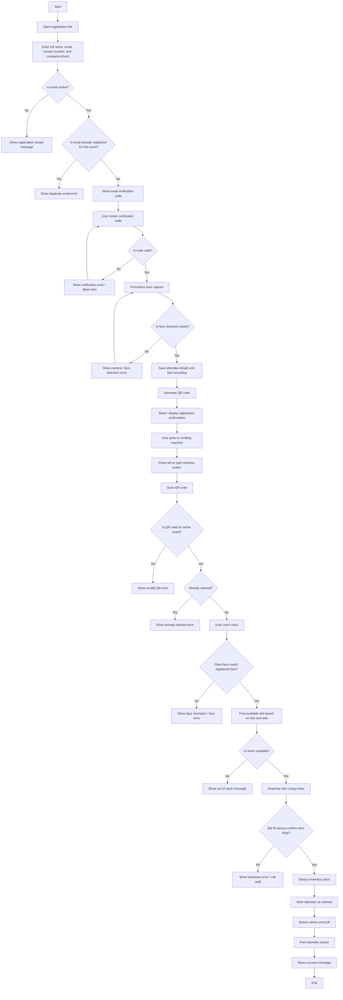
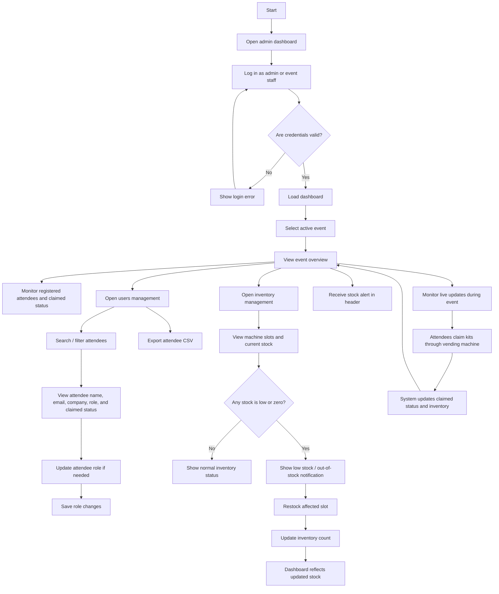

# Vendy System Flowchart

## User / Attendee Side



## Admin / Event Staff Side



## Short Process Summary

```text
User side:
Registration -> Email check -> Email verification -> Face capture -> QR creation -> QR scan at vending machine -> Face verification -> Dispense item -> Print sticker -> Mark claimed

Admin side:
Login -> Select event -> Monitor overview/users/inventory -> Receive low-stock alerts -> Manage attendees and inventory -> Track claims during event
```
